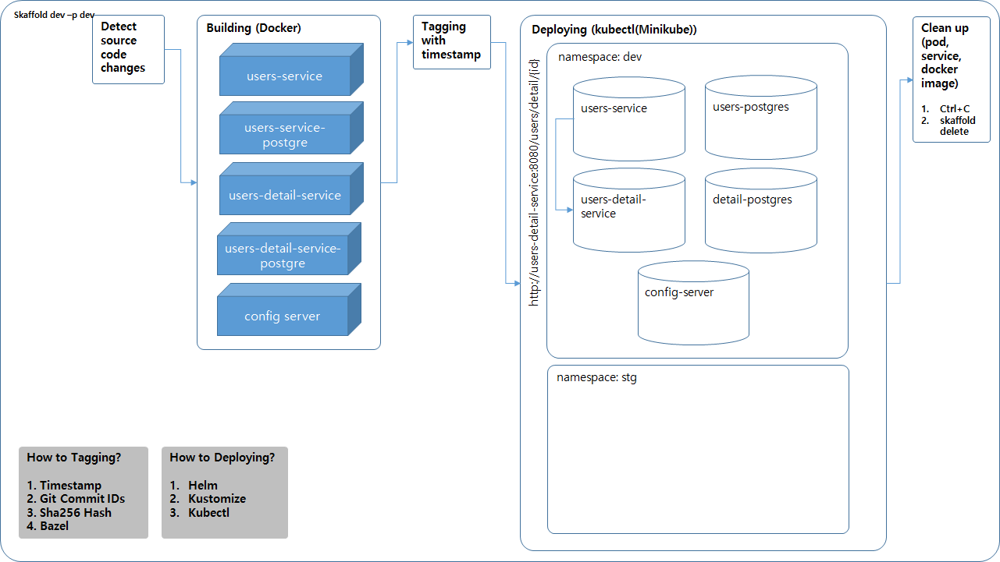

# spring-cloud-example-in-kubernetes

## 0. Structure





## 1. Git clone
```
git clone https://github.com/atropos0116/spring-cloud-example-in-kubernetes.git
```

## 2. Build the Spring Boot apps
```
./config-server/mvnw -DskipTests package
./users-service/mvnw -DskipTests package
./users-detail-service/mvnw -DskipTests package
```

## 3. Build a Docker image and push the image to Docker Hub
```
docker build -t <your Docker Hub account>/config-server:v1 .
docker push <your Docker Hub account>/config-server:v1

docker build -t <your Docker Hub account>/users-service:v1 .
docker push <your Docker Hub account>/users-service:v1

docker build -t <your Docker Hub account>/users-detail-service:v1 .
docker push <your Docker Hub account>/users-detail-service:v1
```

## 4. Skaffold dev
profile : dev
```
cd config-server
skaffold run -p dev

cd users-service
skaffold run -p dev

cd users-detail-service
skaffold dev -p dev
```

profile : stg
```
cd config-server
skaffold run -p stg

cd users-service
skaffold run -p stg

cd users-detail-service
skaffold dev -p stg
```

## 6. Test
```
http://{your Minikube Service IP}:30086/users/{userId}
```

## 7. Update application
```
kubectl set image deployment/config-server sprconfig-server=<your Docker Hub account>/config-server:v2

kubectl set image deployment/users-service users-service=<your Docker Hub account>/users-service:v2

kubectl set image deployment/users-detail-service users-detail-service=<your Docker Hub account>/users-detail-service:v2
```

## 8. Skaffold Clean up
```
Ctrl + C or skaffold delete -p dev or skaffold delete -p stg
```

